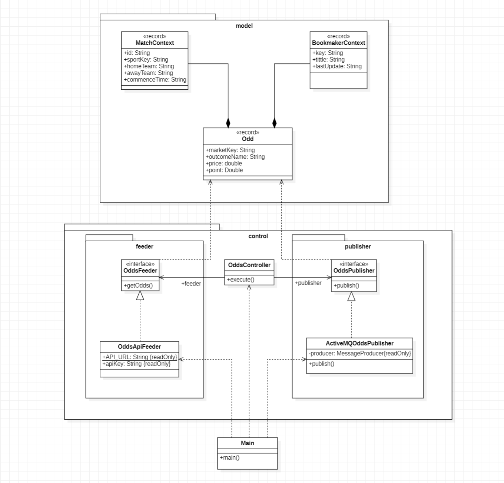
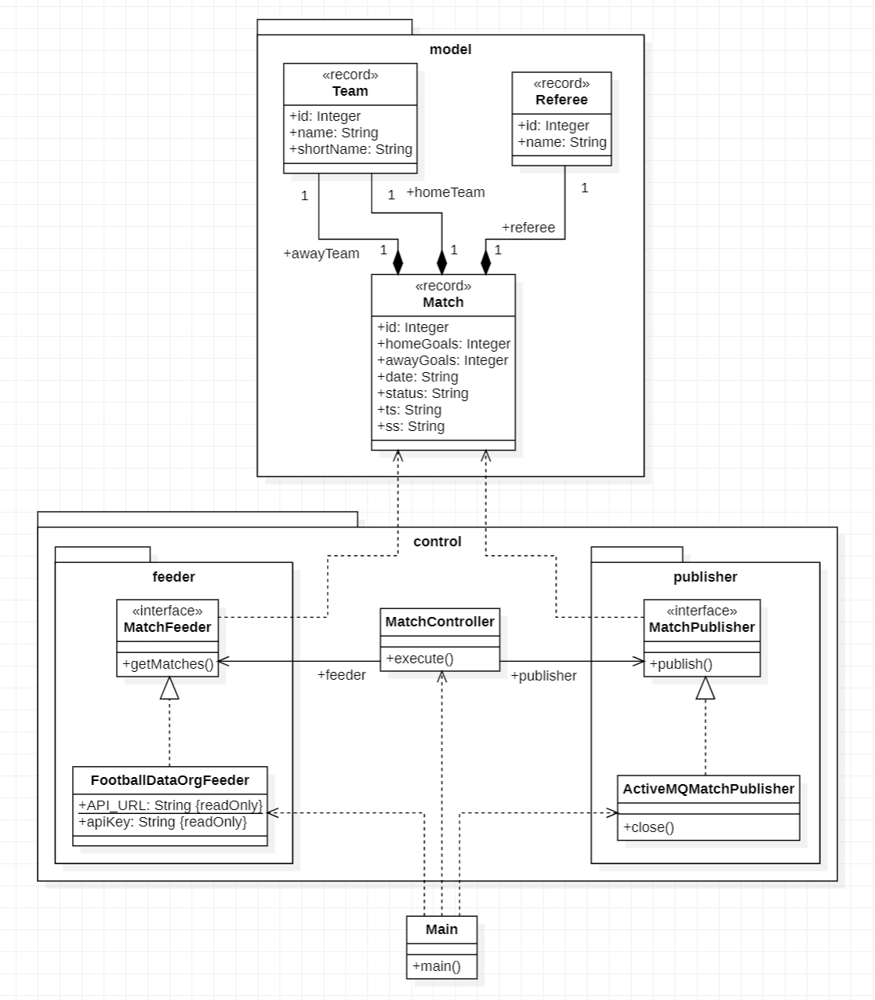
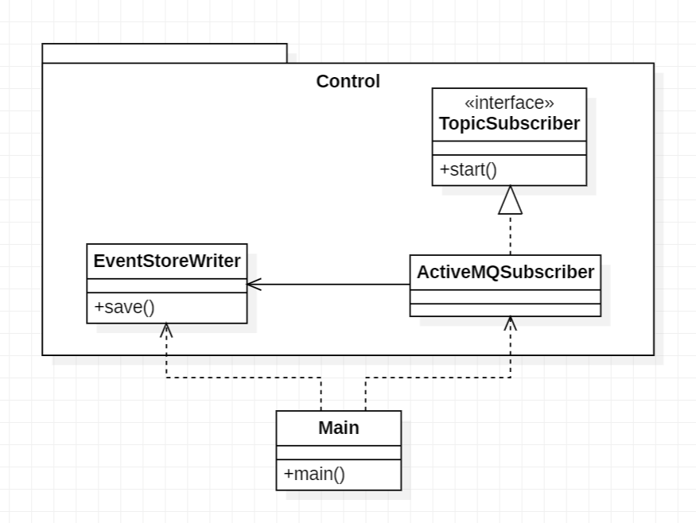
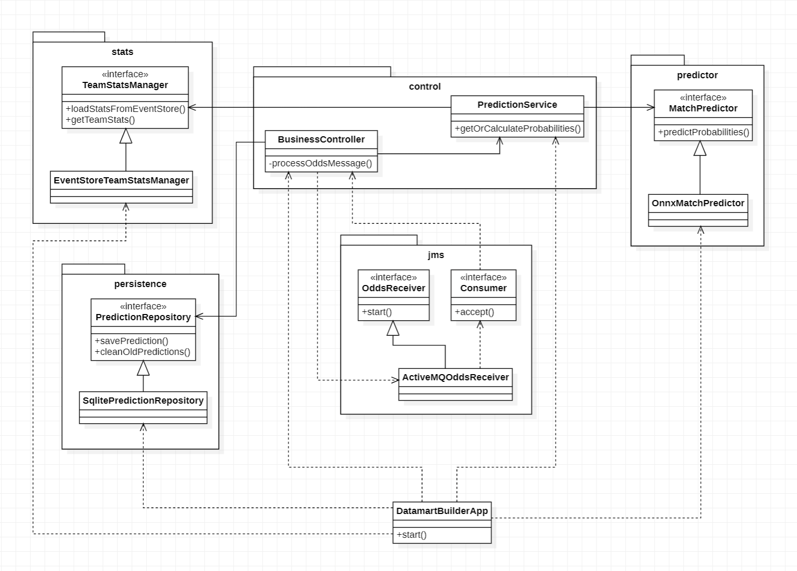
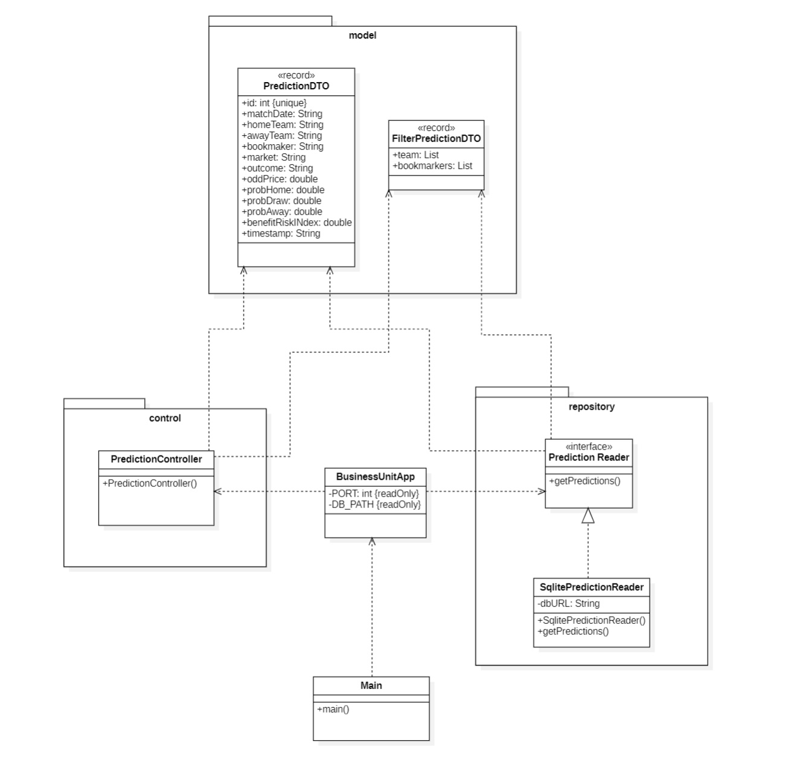

# ⚽ CuotasEnDeporteDACD


> **Plataforma de análisis predictivo de cuotas de fútbol** que combina datos en tiempo real de casas de apuestas con inteligencia artificial para identificar oportunidades con valor esperado positivo en La Liga española.

---

## 📋 Descripción del Proyecto y Propuesta de Valor

### ¿Qué es CuotasEnDeporteDACD?

CuotasEnDeporteDACD es un sistema distribuido orientado a eventos que integra **dos fuentes de datos externas** — cuotas de casas de apuestas y resultados históricos de partidos — para generar predicciones de resultados de fútbol mediante un modelo de **Machine Learning**. El sistema cruza estas predicciones con las cuotas ofrecidas por las casas de apuestas en tiempo real para calcular un **índice de beneficio-riesgo (BRI)** que identifica apuestas potencialmente rentables.

### Propuesta de Valor

El valor diferencial del proyecto reside en la **convergencia de tres disciplinas**:

1. **Ingeniería de datos en tiempo real**: Arquitectura event-driven con Apache ActiveMQ que captura, persiste y procesa eventos de forma asíncrona y desacoplada.
2. **Inteligencia artificial aplicada**: Modelo de Regresión Logística entrenado con datos históricos del Event Store, exportado en formato ONNX para inferencia en tiempo real desde Java.
3. **Análisis financiero cuantitativo**: Cálculo del Benefit-Risk Index (BRI) que permite al usuario discriminar entre cuotas con valor esperado positivo y negativo.

### ¿Cómo funciona el Benefit-Risk Index?

El BRI se calcula con la fórmula:

```
BRI = (probabilidad_IA × cuota_casa_de_apuestas) - 1
```

| Valor del BRI | Interpretación |
|:---:|---|
| **BRI > 0** | La cuota ofrece un valor esperado positivo según el modelo. La casa de apuestas paga más de lo que la IA estima justo. |
| **BRI = 0** | La cuota es justa según el modelo. No hay ventaja estadística. |
| **BRI < 0** | La cuota ofrece un valor esperado negativo. La casa de apuestas paga menos de lo que la IA considera justo. |

> **Ejemplo práctico**: Si el modelo predice un 60% de probabilidad de victoria local y la casa de apuestas ofrece una cuota de 2.10, el BRI sería `(0.60 × 2.10) - 1 = 0.26`, indicando un 26% de valor esperado positivo.

---

## 🏗️ Arquitectura del Sistema

### Visión General

El sistema sigue una **arquitectura Lambda** combinada con un enfoque **event-driven**, utilizando Apache ActiveMQ como broker de mensajería central para desacoplar los productores de datos de los consumidores. La arquitectura Lambda se manifiesta en tres capas:

- **Batch Layer**: El Event Store acumula todos los eventos históricos. El pipeline de Machine Learning (Python) procesa este dataset completo periódicamente para re-entrenar el modelo predictivo.
- **Speed Layer**: El `datamart-builder` procesa los eventos de cuotas en tiempo real conforme llegan al broker, ejecutando inferencia con el modelo ONNX para generar predicciones al instante.
- **Serving Layer**: El `business-unit` expone las predicciones consolidadas a través de una API REST y un dashboard web, consultando el datamart SQLite que unifica los resultados de ambas capas.

Cada módulo es un proceso independiente con su propia responsabilidad.

**Flujo de Arquitectura**
- 🌐 **Fuentes de Datos Externas**
  - The Odds API `→` **`odds`** (Feeder)
  - Football-Data.org `→` **`results`** (Feeder)
- 🔀 **Broker de Mensajería (Apache ActiveMQ)**
  - Topic: `FootballOdd` `←` Recibe de feeder *odds*
  - Topic: `FootballResult` `←` Recibe de feeder *results*
- 📁 **Batch Layer (Procesamiento Histórico)**
  - **`event-store-builder`** `←` Suscripción Durable al Broker y guarda en disco (`.events`)
  - **`datamart-builder`** `→` Orquesta e invoca al pipeline Python **`machine-learning`**
  - **`machine-learning`** `←` Lee ficheros `.events` y genera modelo `.onnx`
- ⚡ **Speed Layer (Inferencia en Tiempo Real)**
  - **`datamart-builder`** `←` Suscripción al Broker (Topic `FootballOdd`) + Carga `.onnx`
  - **`datamart-builder`** `→` Infiere probabilidades y calcula el BRI (Benefit-Risk Index)
- 🖥️ **Serving Layer (Presentación)**
  - **`datamart-builder`** `→` Guarda predicciones en `SQLite` (Datamart)
  - **`business-unit`** `←` Lee de `SQLite` y expone API REST + Dashboard Web

### Flujo de Datos

El flujo completo del sistema, desde la captura hasta la presentación, sigue estos pasos:

1. **Captura**: Los módulos `odds` y `results` consultan periódicamente (cada 24h) sus respectivas APIs externas y publican los datos como eventos JSON en topics de ActiveMQ.
2. **Persistencia**: El `event-store-builder` se suscribe de forma durable a ambos topics y persiste cada evento como ficheros `.events` organizados por fecha y fuente.
3. **Entrenamiento**: El `datamart-builder` orquesta la ejecución del pipeline Python de Machine Learning, que lee el Event Store, calcula features con decaimiento exponencial, entrena un modelo de Regresión Logística y lo exporta en formato ONNX.
4. **Predicción**: Cuando el `datamart-builder` recibe un evento de cuota vía ActiveMQ, carga las estadísticas históricas de los equipos, ejecuta inferencia con el modelo ONNX, calcula el BRI y persiste la predicción en el datamart SQLite.
5. **Presentación**: El `business-unit` expone una API REST que lee el datamart SQLite y sirve un dashboard web interactivo donde el usuario puede filtrar y explorar las predicciones.

### Resumen de Módulos

| Módulo | Responsabilidad | Tecnología Clave | Puerto |
|--------|----------------|-------------------|--------|
| `odds` | Captura de cuotas H2H de casas de apuestas europeas | The Odds API, ActiveMQ | — |
| `results` | Captura de resultados de partidos finalizados | Football-Data.org, ActiveMQ | — |
| `event-store-builder` | Persistencia durable de todos los eventos | ActiveMQ (Durable Subscriber), File I/O | — |
| `datamart-builder` | Entrenamiento ML, inferencia ONNX, cálculo del BRI | ONNX Runtime, SQLite, Python | — |
| `business-unit` | API REST y dashboard web de predicciones | Javalin, SQLite | `7070` |
| `machine-learning` | Pipeline ETL + entrenamiento del modelo predictivo | scikit-learn, pandas, skl2onnx | — |

### Diagramas de Clases por Módulo

#### Módulo `odds`

<p align="center">
  
</p>

#### Módulo `results`

<p align="center">
  
</p>

#### Módulo `event-store-builder`

<p align="center">
  
</p>

#### Módulo `datamart-builder`

<p align="center">
  
</p>

#### Módulo `business-unit`

<p align="center">
  
</p>

---

## 🔌 Justificación de APIs y Estructura del Datamart

### APIs Externas

#### The Odds API — Módulo `odds`

| Aspecto | Detalle |
|---------|---------|
| **URL base** | `https://api.the-odds-api.com/v4/sports/soccer_spain_la_liga/odds/` |
| **Parámetros** | `regions=eu`, `markets=h2h`, `oddsFormat=decimal` |
| **Datos obtenidos** | Cuotas Head-to-Head (1X2) de múltiples casas de apuestas europeas para cada partido programado de La Liga |
| **Formato de respuesta** | JSON con array de partidos, cada uno conteniendo un array de bookmakers con sus mercados y outcomes |
| **Autenticación** | API Key como query parameter (`apiKey`) |

**¿Por qué esta API?**

- **Cobertura multi-bookmaker**: Proporciona cuotas de decenas de casas de apuestas en una sola petición, lo que permite comparar precios y enriquecer el análisis del BRI con múltiples perspectivas de mercado.
- **Formato estandarizado**: Las cuotas se reciben en formato decimal europeo, directamente utilizable en la fórmula del BRI sin necesidad de conversiones.
- **Datos en tiempo real**: Las cuotas se actualizan con frecuencia, reflejando las variaciones del mercado previas al partido.
- **Filtrado por competición**: Permite restringir la consulta a `soccer_spain_la_liga`, evitando procesar datos irrelevantes de otras ligas.

**Estructura del evento `FootballOdd` publicado en ActiveMQ:**

```json
{
  "ts": "2026-05-19T10:30:00Z",
  "ss": "feeder-odds",
  "match": {
    "id": "abc123",
    "sportKey": "soccer_spain_la_liga",
    "homeTeam": "Real Madrid",
    "awayTeam": "FC Barcelona",
    "commenceTime": "2026-05-25T20:00:00Z"
  },
  "bookmaker": {
    "key": "betfair",
    "title": "Betfair",
    "lastUpdate": "2026-05-19T10:25:00Z"
  },
  "marketKey": "h2h",
  "outcomeName": "Real Madrid",
  "price": 2.10,
  "point": null
}
```

> Los campos `ts` (timestamp de captura) y `ss` (source system) son metadatos estándar de trazabilidad presentes en todos los eventos del sistema. Permiten al Event Store organizar los ficheros por fecha y fuente.

---

#### Football-Data.org — Módulo `results`

| Aspecto | Detalle |
|---------|---------|
| **URL base** | `https://api.football-data.org/v4/competitions/PD/matches` |
| **Competición** | `PD` = Primera División (La Liga) |
| **Datos obtenidos** | Todos los partidos de la temporada con estado, goles, equipos (id, nombre, nombre corto) y árbitro |
| **Formato de respuesta** | JSON con objeto `matches[]` que contiene los partidos (se filtran solo los `FINISHED`) |
| **Autenticación** | Header HTTP `X-Auth-Token` |

**¿Por qué esta API?**

- **Datos oficiales y estructurados**: Football-Data.org proporciona datos provenientes de fuentes oficiales de la competición, garantizando la fiabilidad del dataset de entrenamiento.
- **Riqueza del modelo de datos**: Además de goles, incluye identificadores únicos de equipos, nombres cortos, estado del partido y datos del árbitro, lo que permite una trazabilidad completa.
- **Procesamiento incremental (Watermark)**: El módulo `results` utiliza un `WatermarkManager` que persiste en fichero la fecha del último partido procesado, garantizando que solo se publiquen resultados nuevos en cada ejecución. Esto evita duplicados y optimiza el consumo de la API (que tiene límites de peticiones por minuto).
- **Endpoint por competición**: Al consultar directamente `/competitions/PD/matches`, se obtienen todos los partidos de La Liga sin paginación adicional.

**Estructura del evento `FootballResult` publicado en ActiveMQ:**

```json
{
  "ts": "2026-05-19T10:30:00Z",
  "ss": "feeder-results",
  "id": 436254,
  "homeTeam": {
    "id": 86,
    "name": "Real Madrid CF",
    "shortName": "Real Madrid"
  },
  "awayTeam": {
    "id": 81,
    "name": "FC Barcelona",
    "shortName": "Barça"
  },
  "homeGoals": 2,
  "awayGoals": 1,
  "date": "2026-05-10T20:00:00Z",
  "status": "FINISHED",
  "referee": {
    "id": 11,
    "name": "Mateu Lahoz"
  }
}
```

---

### Estructura del Datamart (SQLite)

El datamart es una base de datos SQLite ubicada en `database/predictions.db` que almacena las predicciones generadas por el `datamart-builder`. Actúa como la fuente de datos del `business-unit` para la API REST y el dashboard.

#### ¿Por qué SQLite?

- **Sin servidor**: No requiere instalación ni configuración de un SGBD externo. El fichero `.db` es autocontenido y portable.
- **Concurrencia de lectura con WAL**: Se configura `PRAGMA journal_mode=WAL` (Write-Ahead Logging), lo que permite que el `business-unit` lea predicciones de forma concurrente mientras el `datamart-builder` escribe nuevas entradas sin bloqueos.
- **Rendimiento adecuado**: Para el volumen de datos de La Liga (~380 partidos/temporada × N casas de apuestas × 3 outcomes), SQLite ofrece un rendimiento más que suficiente.
- **Integración nativa con Java**: El driver `xerial/sqlite-jdbc` permite el acceso directo vía JDBC sin dependencias adicionales.

#### Esquema de la tabla `predictions`

```sql
CREATE TABLE IF NOT EXISTS predictions (
    id                  INTEGER PRIMARY KEY AUTOINCREMENT,
    match_date          TEXT    NOT NULL,    -- Fecha de inicio del partido (ISO 8601)
    home_team           TEXT    NOT NULL,    -- Nombre oficial del equipo local
    away_team           TEXT    NOT NULL,    -- Nombre oficial del equipo visitante
    bookmaker           TEXT    NOT NULL,    -- Casa de apuestas (ej: "Betfair")
    market              TEXT    NOT NULL,    -- Tipo de mercado (siempre "h2h")
    outcome             TEXT    NOT NULL,    -- Resultado apostado (equipo local, "Draw", equipo visitante)
    odd_price           REAL    NOT NULL,    -- Cuota decimal ofrecida por la casa de apuestas
    prob_home           REAL    NOT NULL,    -- Probabilidad IA de victoria local (0.0 - 1.0)
    prob_draw           REAL    NOT NULL,    -- Probabilidad IA de empate (0.0 - 1.0)
    prob_away           REAL    NOT NULL,    -- Probabilidad IA de victoria visitante (0.0 - 1.0)
    benefit_risk_index  REAL    NOT NULL,    -- BRI = (prob_IA × cuota) - 1
    timestamp           DATETIME DEFAULT CURRENT_TIMESTAMP  -- Momento de inserción
);
```

#### Índices de rendimiento

```sql
CREATE INDEX IF NOT EXISTS idx_teams    ON predictions(home_team, away_team);
CREATE INDEX IF NOT EXISTS idx_bookmaker ON predictions(bookmaker);
CREATE INDEX IF NOT EXISTS idx_benefit   ON predictions(benefit_risk_index DESC);
```

| Índice | Justificación |
|--------|---------------|
| `idx_teams` | Acelera las consultas filtradas por equipo (`?team=FC Barcelona`), que es el filtro más frecuente del dashboard. |
| `idx_bookmaker` | Optimiza el filtrado por casa de apuestas (`?bookmaker=bet365`). |
| `idx_benefit` | Permite ordenar las predicciones por BRI descendente de forma eficiente, ya que el dashboard muestra primero las apuestas con mayor valor esperado. |

#### Ciclo de vida de los datos

El `datamart-builder` ejecuta una tarea de mantenimiento programada cada **24 horas** que:

1. **Elimina predicciones caducadas**: Borra de la tabla `predictions` todas las filas cuyo `match_date` sea anterior a la fecha actual (`DELETE FROM predictions WHERE datetime(match_date) < datetime('now', '-1 day')`). Esto mantiene el datamart limpio y con solo datos de partidos futuros.
2. **Re-entrena el modelo**: Ejecuta el pipeline Python para incorporar nuevos resultados al dataset de entrenamiento.
3. **Recarga estadísticas**: Vuelve a leer el Event Store para actualizar las estadísticas de rendimiento de cada equipo con los últimos partidos.

---

## 📦 Principios y Patrones de Diseño por Módulo

A lo largo de todo el proyecto se aplican de forma consistente los siguientes principios de diseño:

- **Inversión de Dependencias (DIP)**: Todos los módulos dependen de abstracciones (interfaces), no de implementaciones concretas. Esto permite sustituir cualquier componente sin modificar la lógica de negocio.
- **Principio de Responsabilidad Única (SRP)**: Cada clase tiene una única razón de cambio. Los controladores orquestan, los feeders obtienen datos, los publishers los envían.
- **Inyección de Dependencias por Constructor**: Las dependencias se inyectan en el constructor, facilitando el testing con mocks y la sustitución de implementaciones.
- **Inmutabilidad con Java Records**: Todos los objetos de dominio (`Odd`, `Match`, `Team`, `OddsEvent`, `PredictionDTO`, etc.) son `record`, garantizando inmutabilidad y eliminando el boilerplate.

---

### 5.1 Módulo `odds` — Feeder de Cuotas

**Responsabilidad**: Consultar la API de The Odds API cada 24 horas y publicar cada cuota individual como evento JSON en el topic `FootballOdd` de ActiveMQ.

| Patrón | Aplicación concreta |
|--------|---------------------|
| **Port & Adapter** | La interfaz `OddsFeeder` define el puerto de entrada de datos. `OddsApiFeeder` es el adaptador que implementa la conexión con The Odds API. Si se quisiera cambiar de proveedor, bastaría con crear un nuevo adaptador. |
| **Port & Adapter** | La interfaz `OddsPublisher` define el puerto de salida. `ActiveMQOddsPublisher` es el adaptador para ActiveMQ. Se podría sustituir por Kafka, RabbitMQ, etc. sin tocar el controlador. |
| **Inyección de Dependencias** | `OddsController` recibe `OddsFeeder` y `OddsPublisher` por constructor, desacoplando la lógica de orquestación de las implementaciones concretas. |
| **Scheduled Execution** | `Main` utiliza `ScheduledExecutorService` para ejecutar `controller::execute` periódicamente cada 24 horas. |
| **Value Objects (Records)** | `Odd`, `MatchContext` y `BookmakerContext` son `record` inmutables que encapsulan los datos sin lógica de negocio. |

**Clases principales:**

| Clase | Paquete | Rol |
|-------|---------|-----|
| `OddsController` | `control` | Orquestador: obtiene cuotas del feeder y las publica |
| `OddsFeeder` (interfaz) | `control.feeder` | Puerto de entrada de datos |
| `OddsApiFeeder` | `control.feeder` | Adaptador HTTP hacia The Odds API |
| `OddsPublisher` (interfaz) | `control.publisher` | Puerto de salida de eventos |
| `ActiveMQOddsPublisher` | `control.publisher` | Adaptador JMS hacia ActiveMQ |
| `Odd` (record) | `model` | Evento de cuota con metadatos `ts`/`ss` |

---

### 5.2 Módulo `results` — Feeder de Resultados

**Responsabilidad**: Consultar la API de Football-Data.org cada 24 horas y publicar únicamente los partidos finalizados nuevos (no procesados previamente) como eventos JSON en el topic `FootballResult`.

| Patrón | Aplicación concreta |
|--------|---------------------|
| **Port & Adapter** | Interfaces `MatchFeeder` / `MatchPublisher` con implementaciones `FootballDataOrgFeeder` / `ActiveMQMatchPublisher`. |
| **Watermark Pattern** | `WatermarkManager` persiste en fichero (`last_match_date.txt`) la fecha del último partido procesado. En cada ejecución, solo se publican partidos con fecha posterior al watermark, evitando duplicados y optimizando el uso de la API. |
| **Inyección de Dependencias** | `MatchController` recibe feeder, publisher y watermark manager por constructor. |
| **Value Objects (Records)** | `Match`, `Team` y `Referee` son records inmutables. |

**Clases principales:**

| Clase | Paquete | Rol |
|-------|---------|-----|
| `MatchController` | `control` | Orquestador con lógica de watermark |
| `WatermarkManager` | `control` | Gestiona la fecha de corte para procesamiento incremental |
| `MatchFeeder` (interfaz) | `control.feeder` | Puerto de entrada de resultados |
| `FootballDataOrgFeeder` | `control.feeder` | Adaptador HTTP hacia Football-Data.org |
| `MatchPublisher` (interfaz) | `control.publisher` | Puerto de salida de eventos |
| `ActiveMQMatchPublisher` | `control.publisher` | Adaptador JMS hacia ActiveMQ |
| `Match` (record) | `model` | Evento de resultado con goles, equipos y árbitro |

---

### 5.3 Módulo `event-store-builder` — Almacén de Eventos

**Responsabilidad**: Suscribirse de forma durable a todos los topics de ActiveMQ y persistir cada evento recibido en el sistema de ficheros, organizado por topic, fuente y fecha.

| Patrón | Aplicación concreta |
|--------|---------------------|
| **Port & Adapter** | La interfaz `TopicSubscriber` define el puerto de suscripción. `ActiveMQSubscriber` implementa la conexión durable con ActiveMQ. |
| **Observer / Listener** | Utiliza `MessageListener` de JMS para reaccionar de forma asíncrona a la llegada de nuevos eventos. |
| **Durable Subscription** | Se configura un `clientID` y un `durableSubscriber` por topic, garantizando que no se pierdan eventos aunque el módulo esté temporalmente caído. |
| **Reconnect con Backoff Exponencial** | Si la conexión con ActiveMQ se pierde, el suscriptor reintenta con retardos crecientes (5s → 10s → 20s → ... → 60s máx.), evitando saturar el broker. |

**Convención de almacenamiento del Event Store:**

```
eventstore/
├── FootballOdd/
│   └── feeder-odds/
│       ├── 20260510.events
│       ├── 20260511.events
│       └── ...
└── FootballResult/
    └── feeder-results/
        ├── 20260510.events
        ├── 20260511.events
        └── ...
```

Cada fichero `.events` contiene un evento JSON por línea (formato JSON Lines), facilitando el procesamiento secuencial por el pipeline de Machine Learning.

**Clases principales:**

| Clase | Paquete | Rol |
|-------|---------|-----|
| `TopicSubscriber` (interfaz) | `control` | Puerto de suscripción a topics |
| `ActiveMQSubscriber` | `control` | Adaptador JMS con suscripción durable y reconnect |
| `EventStoreWriter` | `control` | Escritor de eventos en ficheros organizados por fecha |

---

### 5.4 Módulo `datamart-builder` — Constructor del Datamart con IA

**Responsabilidad**: Orquestar el entrenamiento del modelo ML, escuchar eventos de cuotas en tiempo real, ejecutar inferencia con el modelo ONNX, calcular el BRI y persistir las predicciones en el datamart SQLite.

| Patrón | Aplicación concreta |
|--------|---------------------|
| **Orchestrator** | `DatamartBuilderApp` es el orquestador central que coordina el arranque secuencial de todos los componentes: trainer → stats → predictor → repository → receiver. |
| **Strategy** | Las interfaces `MatchPredictor`, `TeamStatsManager`, `ModelTrainer` y `PredictionRepository` definen estrategias intercambiables. Cada una tiene una implementación concreta que puede ser sustituida sin afectar al resto del sistema. |
| **Cache** | `PredictionCache` almacena en memoria las probabilidades ya calculadas para evitar inferencias redundantes del modelo ONNX cuando llegan múltiples cuotas del mismo partido (una por cada bookmaker × outcome). Capacidad máxima: 1000 entradas con limpieza automática. |
| **Adapter** | `TeamNameMapper` adapta los nombres de equipos de diferentes fuentes (The Odds API, Football-Data.org) a un nombre oficial unificado mediante un diccionario JSON compartido (`teams.json`). |
| **Bridge Java↔Python** | `PythonModelTrainer` invoca el pipeline Python como subproceso, detectando automáticamente el sistema operativo (Windows/Mac/Linux) para localizar el ejecutable de Python dentro del virtualenv. |
| **Repository** | `PredictionRepository` / `SqlitePredictionRepository` encapsula el acceso a la base de datos, con operaciones de escritura (`savePrediction`) y mantenimiento (`cleanOldPredictions`). |
| **Port & Adapter (JMS)** | `OddsReceiver` / `ActiveMQOddsReceiver` recibe las cuotas del topic `FootballOdd` y delega el procesamiento al `BusinessController` mediante un `Consumer<String>`. |

**Clases principales:**

| Clase | Paquete | Rol |
|-------|---------|-----|
| `DatamartBuilderApp` | raíz | Orquestador del arranque completo |
| `BusinessController` | `control` | Procesa cuotas recibidas, invoca predicción y persiste |
| `PredictionService` | `control` | Servicio de predicción con caché integrada |
| `PredictionCache` | `control` | Caché en memoria de predicciones por partido |
| `TeamNameMapper` | `control` | Normalizador de nombres de equipos |
| `MatchPredictor` (interfaz) | `control.predictor` | Estrategia de predicción |
| `OnnxMatchPredictor` | `control.predictor` | Implementación con ONNX Runtime |
| `TeamStatsManager` (interfaz) | `control.stats` | Estrategia de cálculo de estadísticas |
| `EventStoreTeamStatsManager` | `control.stats` | Lee el Event Store y calcula stats con decaimiento exponencial (λ=0.9) |
| `ModelTrainer` (interfaz) | `control.trainer` | Estrategia de entrenamiento |
| `PythonModelTrainer` | `control.trainer` | Invoca el pipeline Python como subproceso |
| `PredictionRepository` (interfaz) | `control.persistence` | Estrategia de persistencia |
| `SqlitePredictionRepository` | `control.persistence` | Implementación SQLite con WAL |

---

### 5.5 Módulo `business-unit` — API REST y Dashboard Web

**Responsabilidad**: Exponer una API REST que consulta el datamart SQLite y servir un dashboard web interactivo para la visualización de predicciones.

| Patrón | Aplicación concreta |
|--------|---------------------|
| **MVC (Model-View-Controller)** | `PredictionController` actúa como controlador que recibe peticiones HTTP, `PredictionReader` como modelo de acceso a datos, y los ficheros estáticos (`index.html`, `styles.css`, `app.js`) como vista. |
| **DTO (Data Transfer Object)** | `PredictionDTO` y `FilterOptionsDTO` son records que transportan datos entre la capa de repositorio y la API REST, desacoplando la estructura de la BD de la respuesta JSON. |
| **Repository** | La interfaz `PredictionReader` define operaciones de lectura pura (`getPredictions`, `getFilterOptions`). `SqlitePredictionReader` implementa las consultas SQL con filtrado dinámico. |
| **Static File Serving** | Javalin sirve el frontend estático desde `/public` dentro del classpath, permitiendo que el dashboard sea accesible en la misma URL que la API. |

**Clases principales:**

| Clase | Paquete | Rol |
|-------|---------|-----|
| `BusinessUnitApp` | raíz | Configuración de Javalin, rutas y arranque del servidor |
| `PredictionController` | `controller` | Maneja peticiones REST y delega en el repositorio |
| `PredictionReader` (interfaz) | `repository` | Puerto de lectura de predicciones |
| `SqlitePredictionReader` | `repository` | Implementación SQLite con consultas dinámicas y caché de filtros |
| `PredictionDTO` (record) | `model` | Objeto de transferencia con todos los campos de una predicción |
| `FilterOptionsDTO` (record) | `model` | Listas de equipos y casas de apuestas disponibles para filtrado |

---

### 5.6 Módulo `machine-learning` — Pipeline ML (Python)

**Responsabilidad**: Leer eventos históricos del Event Store, calcular features de rendimiento con decaimiento exponencial, entrenar un modelo de Regresión Logística y exportarlo en formato ONNX para su consumo desde Java.

| Patrón | Aplicación concreta |
|--------|---------------------|
| **ETL Pipeline** | El flujo `main.py` sigue un pipeline clásico: **Extract** (`data_extraction.py` lee ficheros `.events`), **Transform** (`features.py` calcula las features con ventana deslizante), **Load** (`model_trainer.py` entrena y exporta el modelo). |
| **Interoperabilidad ONNX** | El modelo se entrena con scikit-learn pero se exporta a formato ONNX mediante `skl2onnx`, permitiendo su consumo desde Java con ONNX Runtime sin necesidad de un servidor Python en producción. |
| **Decaimiento Exponencial** | Las features de rendimiento (`Streak_Points`, `Avg_Goals_For`, `Avg_Goals_Against`) se calculan con pesos decrecientes (λ=0.9), dando mayor importancia a los partidos recientes. Esta misma lógica se replica en Java (`EventStoreTeamStatsManager`) para garantizar consistencia entre entrenamiento e inferencia. |
| **Shared Dictionary** | `team_mapper.py` carga el mismo diccionario `teams.json` que usa el módulo Java, garantizando que los nombres de equipos sean consistentes entre el dataset de entrenamiento y los eventos en tiempo real. |

#### Diagrama de Flujo (Pipeline ETL)

#### Diagrama de Flujo (Pipeline ETL)

- 📥 **Extract**: Ficheros `.events` `→` `data_extraction.py` `→` Dataset Crudo
- ⚙️ **Transform**: Dataset Crudo `→` `features.py` + `team_mapper.py` `→` Features con Decaimiento Exponencial
- 🧠 **Load/Train**: Features `→` `model_trainer.py` `→` Regresión Logística `→` `skl2onnx` `→` `match_model.onnx`

**Ficheros principales:**

| Fichero | Rol |
|---------|-----|
| `main.py` | Punto de entrada del pipeline ETL |
| `data_extraction.py` | Lee ficheros `.events` y extrae datos de partidos finalizados |
| `features.py` | Calcula features con `TeamHistory` y decaimiento exponencial |
| `model_trainer.py` | Entrena `LogisticRegression` y exporta a ONNX |
| `team_mapper.py` | Normaliza nombres de equipos usando `teams.json` compartido |
| `requirements.txt` | Dependencias: `pandas`, `scikit-learn`, `skl2onnx`, `numpy` |

---

## ⚙️ Requisitos Previos

### Software necesario

| Requisito | Versión mínima | Verificación |
|-----------|---------------|--------------|
| **Java JDK** | 21 | `java -version` |
| **Apache Maven** | 3.8+ | `mvn -version` |
| **Python** | 3.10+ | `python --version` |
| **Apache ActiveMQ** | 5.x (Classic) | Descarga en [activemq.apache.org](https://activemq.apache.org/components/classic/download/) |

### Claves API requeridas

| API | Obtención | Configuración |
|-----|-----------|---------------|
| **The Odds API** | Registro gratuito en [the-odds-api.com](https://the-odds-api.com/) | Se pasa como **Program Argument** al módulo `odds` |
| **Football-Data.org** | Registro gratuito en [football-data.org](https://www.football-data.org/client/register) | Se pasa como **Program Argument** al módulo `results` |

### Instalación de ActiveMQ

1. Descargar Apache ActiveMQ Classic desde la [página oficial](https://activemq.apache.org/components/classic/download/).
2. Descomprimir en una ruta sin espacios.
3. Iniciar el broker:

```text
# En Windows:
cd apache-activemq-5.x.x\bin
activemq start

# En Linux / macOS:
cd apache-activemq-5.x.x/bin
./activemq start
```

4. Verificar que el broker está activo accediendo a la consola web: [http://localhost:8161](http://localhost:8161) (usuario: `admin`, contraseña: `admin`).

### Configuración del entorno Python

```text
# 1. Crear entorno virtual:
cd machine-learning
python -m venv venv

# 2. Activar entorno:
# Windows: venv\Scripts\activate
# Linux/macOS: source venv/bin/activate

# 3. Instalar dependencias:
pip install -r requirements.txt
```

---

## 🚀 Compilación y Ejecución

### Compilación del proyecto completo

Desde la **raíz del proyecto** (donde se encuentra el `pom.xml` padre):

```text
mvn clean package -DskipTests
```

Esto compilará los 5 módulos Java (`odds`, `results`, `event-store-builder`, `datamart-builder`, `business-unit`) y generará sus respectivos JARs en las carpetas `target/` de cada módulo.

### Orden de arranque

> **Importante**: Los módulos deben arrancarse en el siguiente orden estricto para garantizar que las dependencias estén disponibles. El `datamart-builder` debe arrancarse primero (tras ActiveMQ) porque necesita suscribirse al topic de cuotas **antes** de que los feeders comiencen a publicar eventos.

#### Paso 1 — Iniciar Apache ActiveMQ

El broker de mensajería debe estar corriendo antes de arrancar cualquier módulo del proyecto.

```text
activemq start
```

#### Paso 2 — Datamart Builder

```text
cd datamart-builder
java -jar target/datamart-builder-v1.0.0.jar .
```

El argumento `.` indica la ruta base del proyecto. Al arrancar:
1. Ejecuta el pipeline Python para entrenar el modelo.
2. Carga las estadísticas históricas del Event Store.
3. Se suscribe al topic `FootballOdd` para procesar cuotas en tiempo real.
4. Genera predicciones y las persiste en `database/predictions.db`.

> Se arranca antes que los feeders para que esté escuchando el topic de cuotas cuando estos publiquen los eventos.

#### Paso 3 — Event Store Builder

```text
cd event-store-builder
java -jar target/event-store-builder-v1.0.0.jar
```

Se suscribe de forma durable a los topics `FootballOdd` y `FootballResult` y persiste cada evento en el sistema de ficheros. Debe estar corriendo antes de que los feeders publiquen datos para no perder eventos.

#### Paso 4 — Feeders: Odds y Results

Los feeders pueden arrancarse en cualquier orden entre sí. Ambos requieren su respectiva **API key** como primer argumento:

```text
# Feeder de cuotas:
cd odds
java -jar target/odds-v1.0.0.jar <Odds_apiKey>

# Feeder de resultados:
cd results
java -jar target/results-v1.0.0.jar <Results_apiKey>
```

- `odds` captura las cuotas H2H de casas de apuestas europeas y las publica en ActiveMQ. Se ejecuta inmediatamente y repite cada 24 horas.
- `results` captura los partidos finalizados de La Liga y publica los nuevos en ActiveMQ. Se ejecuta inmediatamente y repite cada 24 horas.

#### Paso 5 — Business Unit

```text
cd business-unit
java -jar target/business-unit-v1.0.0.jar
```

Inicia el servidor Javalin en el puerto **7070**. El dashboard web estará disponible en:

```
http://localhost:7070
```

---

### Ejecución desde IntelliJ IDEA (método recomendado)

El proyecto incluye **Run Configurations** preconfiguradas para IntelliJ IDEA que permiten ejecutar cada módulo directamente desde el IDE sin necesidad de generar JARs.

#### Configuraciones disponibles

| Configuración | Clase Main | Requiere API Key |
|---------------|-----------|------------------|
| `datamart-builder` | `org.ulpgc.dacd.datamart.Main` | No |
| `event-store-builder` | `org.ulpgc.dacd.Main` | No |
| `odds` | `org.ulpgc.dacd.Main` | ✅ Sí |
| `results` | `org.ulpgc.dacd.Main` | ✅ Sí |
| `business-unit` | `org.ulpgc.dacd.business.Main` | No |

#### Configurar las API Keys en IntelliJ

Los módulos `odds` y `results` requieren sus respectivas API keys como **Program Arguments**. Para configurarlas:

1. Ir a **Run → Edit Configurations...** (o hacer clic en el desplegable de configuraciones de la barra superior).
2. Seleccionar la configuración **`odds`**.
3. En el campo **Program arguments**, introducir la API key de The Odds API.
4. Repetir para la configuración **`results`** con la API key de Football-Data.org.

<p align="center">
  
</p>

#### Orden de ejecución desde IntelliJ

Ejecutar las configuraciones en el siguiente orden desde el selector de Run Configurations (arriba a la derecha del IDE):

1. ▶️ **`datamart-builder`** — Entrenar modelo y escuchar cuotas.
2. ▶️ **`event-store-builder`** — Persistir eventos.
3. ▶️ **`odds`** — Publicar cuotas (requiere API key configurada).
4. ▶️ **`results`** — Publicar resultados (requiere API key configurada).
5. ▶️ **`business-unit`** — Iniciar el dashboard web en `http://localhost:7070`.

> **Nota**: Cada módulo se ejecuta en su propia pestaña de la consola de IntelliJ. Todos deben estar corriendo simultáneamente (excepto los feeders, que se ejecutan periódicamente cada 24h).

---

## 📡 Ejemplos de Uso

### Endpoints REST disponibles

| Método | Endpoint | Descripción | Parámetros |
|--------|----------|-------------|------------|
| `GET` | `/api/predictions` | Lista todas las predicciones de partidos futuros, ordenadas por BRI descendente | `team` (opcional), `bookmaker` (opcional) |
| `GET` | `/api/filters` | Devuelve las opciones de filtrado disponibles (equipos y casas de apuestas) | — |
| `GET` | `/api/health` | Health check del módulo | — |

### Ejemplos con cURL

**Obtener todas las predicciones:**

```text
curl http://localhost:7070/api/predictions
```

**Filtrar por equipo:**

```text
curl "http://localhost:7070/api/predictions?team=Real%20Madrid%20CF"
```

**Filtrar por casa de apuestas:**

```text
curl "http://localhost:7070/api/predictions?bookmaker=bet365"
```

**Combinar filtros:**

```text
curl "http://localhost:7070/api/predictions?team=FC%20Barcelona&bookmaker=Betfair"
```

**Obtener opciones de filtrado:**

```text
curl http://localhost:7070/api/filters
```

**Health check:**

```text
curl http://localhost:7070/api/health
```

### Ejemplo de respuesta JSON

#### `GET /api/predictions`

```json
[
  {
    "id": 142,
    "matchDate": "2026-05-25T20:00:00Z",
    "homeTeam": "Real Madrid CF",
    "awayTeam": "FC Barcelona",
    "bookmaker": "Betfair",
    "market": "h2h",
    "outcome": "Real Madrid CF",
    "oddPrice": 2.10,
    "probHome": 0.58,
    "probDraw": 0.24,
    "probAway": 0.18,
    "benefitRiskIndex": 0.218,
    "timestamp": "2026-05-19T10:30:15"
  },
  {
    "id": 143,
    "matchDate": "2026-05-25T20:00:00Z",
    "homeTeam": "Real Madrid CF",
    "awayTeam": "FC Barcelona",
    "bookmaker": "Betfair",
    "market": "h2h",
    "outcome": "Draw",
    "oddPrice": 3.40,
    "probHome": 0.58,
    "probDraw": 0.24,
    "probAway": 0.18,
    "benefitRiskIndex": -0.184,
    "timestamp": "2026-05-19T10:30:15"
  }
]
```

**Interpretación de la respuesta:**

- El primer registro tiene un `benefitRiskIndex` de **0.218** (positivo), lo que indica que la cuota de 2.10 por la victoria del Real Madrid ofrece un **21.8% de valor esperado positivo** según el modelo de IA.
- El segundo registro tiene un `benefitRiskIndex` de **-0.184** (negativo), lo que indica que la cuota de 3.40 por el empate tiene un valor esperado negativo y el modelo no la considera rentable.

#### `GET /api/filters`

```json
{
  "teams": [
    "Athletic Club",
    "Atlético de Madrid",
    "CA Osasuna",
    "Celta de Vigo",
    "FC Barcelona",
    "Getafe CF",
    "Girona FC",
    "RCD Espanyol de Barcelona",
    "RCD Mallorca",
    "Real Betis Balompié",
    "Real Madrid CF",
    "Real Sociedad de Fútbol",
    "Real Valladolid CF",
    "RC Deportivo La Coruña",
    "Rayo Vallecano de Madrid",
    "Sevilla FC",
    "UD Las Palmas",
    "Valencia CF",
    "Villarreal CF",
    "CD Leganés"
  ],
  "bookmakers": [
    "1xBet",
    "Betfair",
    "bet365",
    "Pinnacle",
    "Unibet"
  ]
}
```

#### `GET /api/health`

```json
{
  "status": "ok",
  "module": "business-unit",
  "port": 7070
}
```

### Dashboard Web

El dashboard web está accesible en `http://localhost:7070` y ofrece:

- **Ranking de predicciones** ordenado por Benefit-Risk Index descendente, destacando visualmente las apuestas con mayor valor.
- **Filtros interactivos** por equipo y casa de apuestas para explorar predicciones específicas.
- **Visualización de probabilidades** con gráficas que muestran la distribución de probabilidad de victoria local, empate y victoria visitante para cada partido.
- **Detalle por partido** con modal que despliega las cuotas de todas las casas de apuestas para un mismo enfrentamiento.

---

## 🛠️ Tecnologías Utilizadas

| Tecnología | Versión | Propósito |
|-----------|---------|-----------|
| **Java** | 21 | Lenguaje principal de los 5 módulos del backend |
| **Apache Maven** | 3.8+ | Gestión de dependencias y compilación multi-módulo |
| **Apache ActiveMQ** | 5.15.12 | Broker de mensajería JMS para la comunicación event-driven entre módulos |
| **Gson** | 2.10.1 | Serialización/deserialización JSON de eventos y respuestas API |
| **Javalin** | 6.4.0 | Framework web ligero para la API REST y el servicio de ficheros estáticos |
| **SQLite** (xerial JDBC) | 3.45.1.0 | Base de datos embebida para el datamart de predicciones |
| **ONNX Runtime** | 1.20.0 | Inferencia del modelo de Machine Learning desde Java |
| **SLF4J** | 2.0.16 | Logging del servidor Javalin |
| **JUnit 5** | 5.10.0 | Framework de testing unitario |
| **Mockito** | 5.5.0 | Mocking de dependencias en tests |
| **Python** | 3.10+ | Pipeline de Machine Learning |
| **scikit-learn** | — | Entrenamiento del modelo de Regresión Logística |
| **pandas** | — | Manipulación del dataset histórico |
| **skl2onnx** | — | Exportación del modelo scikit-learn a formato ONNX |
| **NumPy** | — | Operaciones numéricas para la preparación de datos |
| **HTML/CSS/JS** | — | Frontend del dashboard web interactivo |

---

## 🔮 Trabajo Futuro

### Enriquecimiento del modelo con más variables

El modelo actual utiliza 6 features basadas en rendimiento histórico (puntos ponderados, goles a favor y en contra para local y visitante). Líneas de mejora:

- **Incorporar variables contextuales**: posesión media, tiros a puerta, corners, tarjetas, lesiones de jugadores clave y estado de forma individual (datos disponibles en APIs como Opta o StatsBomb).
- **Factores ambientales**: condiciones meteorológicas, distancia de desplazamiento del equipo visitante, efecto de la altitud del estadio.
- **Variables de mercado**: variaciones de cuotas entre bookmakers como indicador de información privilegiada del mercado (steam moves).

### Expansión a más competiciones

Actualmente el sistema está configurado para **La Liga española**. La arquitectura modular del proyecto permitiría incorporar nuevas ligas con cambios mínimos:

- Añadir nuevos feeders con los identificadores de competición correspondientes (por ejemplo, `PL` para la Premier League, `BL1` para la Bundesliga).
- Entrenar modelos específicos por liga o un modelo generalista multi-competición.

### Modelos matemáticos más avanzados

El modelo actual (Regresión Logística) es un buen punto de partida por su interpretabilidad, pero existen alternativas más potentes y adaptadas al dominio de predicción deportiva:

- **Gradient Boosting (XGBoost / LightGBM)**: Modelos de ensamble basados en árboles de decisión que capturan relaciones no lineales entre features. Son el estándar actual en competiciones de predicción deportiva y ofrecen mejor rendimiento con datasets moderados.
- **Redes Neuronales Recurrentes (LSTM)**: Capturan dependencias temporales largas en las secuencias de partidos de cada equipo, modelando directamente la evolución de la forma deportiva sin necesidad de features de ventana deslizante.
- **Modelos de Poisson Bivariante**: Aproximación estadística clásica en predicción de fútbol que modela directamente la distribución de goles de cada equipo como procesos de Poisson correlados, permitiendo generar probabilidades 1X2 de forma probabilística.
- **Calibración de probabilidades**: Aplicar técnicas como Platt Scaling o Isotonic Regression para asegurar que las probabilidades predichas sean bien calibradas (que un 60% de probabilidad predicha se traduzca realmente en un 60% de aciertos históricos), lo cual es crítico para el cálculo fiable del BRI.

### Mejora continua del modelo

A medida que el Event Store acumula más partidos, el modelo se beneficiaría de:

- **Re-entrenamiento incremental** más frecuente (actualmente cada 24h) con validación cruzada temporal.
- **Monitorización de drift**: Detectar cuándo las predicciones del modelo empiezan a divergir de los resultados reales, indicando la necesidad de un re-entrenamiento con nuevos hiperparámetros.
- **A/B testing de modelos**: Comparar simultáneamente diferentes algoritmos en producción para seleccionar el que ofrezca mejor BRI acumulado.

---

## 👥 Autoría

| | |
|---|---|
| **Autores** |Tomás Santana Suárez<br/>  Pablo Santana González|
| **Titulación** | Grado en Ciencia e Ingeniería de Datos |
| **Universidad** | Universidad de Las Palmas de Gran Canaria (ULPGC) |
| **Asignatura** | Desarrollo de Aplicaciones para Ciencia de Datos (DACD) |