# CuotasEnDeporteDACD

> **Plataforma de análisis predictivo de cuotas de fútbol que combina cuotas de mercado, resultados históricos y un modelo de Machine Learning para detectar cuotas con posible valor esperado positivo en La Liga española.**

<p align="center">
  
  
  
  
  
  
  
  
</p>

---

## Descripción del Proyecto

`CuotasEnDeporteDACD` es un sistema distribuido orientado a eventos para analizar cuotas deportivas de partidos de La Liga. El proyecto ingiere dos tipos de datos externos:

- **Cuotas prepartido** de The Odds API para mercados `h2h`.
- **Resultados históricos** de Football-Data.org para construir el historial deportivo de los equipos.

Con esos datos, el sistema entrena un modelo de **Regresión Logística** en Python, lo exporta a **ONNX** y lo consume desde Java para generar probabilidades de victoria local, empate y victoria visitante. Después cruza esas probabilidades con las cuotas publicadas por las casas de apuestas y calcula un **Benefit-Risk Index (BRI)**:

```text
BRI = (probabilidad_modelo * cuota_decimal) - 1
```

La aplicación no pretende garantizar apuestas rentables ni sustituir un análisis financiero profesional. Es un proyecto académico de ingeniería de datos que muestra cómo integrar APIs, mensajería, Event Store, datamart, Machine Learning e interfaz web en una arquitectura modular.

### Propuesta de Valor

El valor del proyecto está en unir tres capas que normalmente aparecen separadas:

- **Ingesta desacoplada en tiempo real**: los feeders publican eventos JSON en ActiveMQ sin depender de la lógica de negocio.
- **Histórico reproducible**: el Event Store conserva los eventos crudos para poder reconstruir el estado y reentrenar el modelo.
- **Serving analítico**: el datamart SQLite permite consultar predicciones, filtrar por equipo o bookmaker y visualizar el ranking de cuotas con mayor BRI.

### Estructura del Proyecto

```text
CuotasEnDeporteDACD/
├── business-unit/              # API REST con Javalin y dashboard web
├── database/                   # Datamart SQLite generado en ejecución
│   └── predictions.db
├── datamart-builder/           # Inferencia ONNX, cálculo de BRI y escritura del datamart
├── docs/                       # Diagramas UML por sprint
│   ├── Sprint1/
│   ├── Sprint2/
│   └── Sprint3/
├── event-store-builder/        # Suscriptor durable de ActiveMQ y persistencia de eventos
├── eventstore/                 # Event Store local con eventos .events
│   ├── FootballOdd/
│   └── FootballResult/
├── machine-learning/           # Pipeline Python: extracción, features, entrenamiento y exportación ONNX
├── models/                     # Modelo ONNX listo para inferencia Java
│   └── match_model.onnx
├── odds/                       # Feeder de cuotas desde The Odds API
├── results/                    # Feeder de resultados desde Football-Data.org
├── pom.xml                     # POM padre Maven multi-módulo
└── README.md
```

---

## Fuentes de Datos y Estructura del Datamart

### Justificación de las Fuentes

#### The Odds API

`odds` consume el endpoint:

```text
https://api.the-odds-api.com/v4/sports/soccer_spain_la_liga/odds/
```

Parámetros usados:

| Parámetro | Valor | Motivo |
|---|---|---|
| `regions` | `eu` | Prioriza casas de apuestas europeas |
| `markets` | `h2h` | Obtiene mercado 1X2: local, empate, visitante |
| `oddsFormat` | `decimal` | Permite aplicar directamente la fórmula del BRI |
| `apiKey` | Program argument | Evita guardar credenciales en el código |

Se eligió porque devuelve cuotas de múltiples bookmakers con un formato JSON homogéneo. Esto permite comparar la probabilidad implícita del mercado con la probabilidad estimada por el modelo.

#### Football-Data.org

`results` consume:

```text
https://api.football-data.org/v4/competitions/PD/matches
```

La competición `PD` corresponde a Primera División española. El módulo filtra partidos con estado `FINISHED` y publica únicamente resultados nuevos gracias a un watermark local en:

```text
results/last_match_date.txt
```

Se eligió porque ofrece resultados estructurados, identificadores de equipos, nombres oficiales/cortos, goles, fechas y árbitros. Es suficiente para construir un primer modelo basado en forma reciente de los equipos.

### Esquemas de Eventos

#### `FootballOdd`

Cada cuota individual se publica como un evento independiente en el topic `FootballOdd`:

```json
{
  "ts": "2026-05-19T10:30:00Z",
  "ss": "feeder-odds",
  "match": {
    "id": "abc123",
    "sportKey": "soccer_spain_la_liga",
    "homeTeam": "Real Madrid",
    "awayTeam": "FC Barcelona",
    "commenceTime": "2026-05-25T20:00:00Z"
  },
  "bookmaker": {
    "key": "betfair",
    "title": "Betfair",
    "lastUpdate": "2026-05-19T10:25:00Z"
  },
  "marketKey": "h2h",
  "outcomeName": "Real Madrid",
  "price": 2.10,
  "point": null
}
```

#### `FootballResult`

Cada partido finalizado se publica en el topic `FootballResult`:

```json
{
  "ts": "2026-05-19T10:30:00Z",
  "ss": "feeder-results",
  "id": 436254,
  "homeTeam": {
    "id": 86,
    "name": "Real Madrid CF",
    "shortName": "Real Madrid"
  },
  "awayTeam": {
    "id": 81,
    "name": "FC Barcelona",
    "shortName": "Barça"
  },
  "homeGoals": 2,
  "awayGoals": 1,
  "date": "2026-05-10T20:00:00Z",
  "status": "FINISHED",
  "referee": {
    "id": 11,
    "name": "Mateu Lahoz"
  }
}
```

### Almacén de Eventos

El módulo `event-store-builder` se suscribe de forma durable a `FootballOdd` y `FootballResult`. Cada evento se guarda como una línea JSON dentro de ficheros `.events`, organizados por topic, source system y fecha UTC:

```text
eventstore/
├── FootballOdd/
│   └── feeder-odds/
│       └── YYYYMMDD.events
└── FootballResult/
    └── feeder-results/
        └── YYYYMMDD.events
```

Esta estructura permite:

- Reentrenar el modelo sin volver a llamar a las APIs externas.
- Reproducir el histórico de resultados consumido por el pipeline de Machine Learning.
- Mantener eventos crudos como fuente de verdad.

### Esquema del Datamart

El datamart es una base de datos SQLite ubicada en:

```text
database/predictions.db
```

Solo contiene la tabla necesaria para servir el dashboard:

```sql
CREATE TABLE IF NOT EXISTS predictions (
    id                  INTEGER PRIMARY KEY AUTOINCREMENT,
    match_date          TEXT    NOT NULL,
    home_team           TEXT    NOT NULL,
    away_team           TEXT    NOT NULL,
    bookmaker           TEXT    NOT NULL,
    market              TEXT    NOT NULL,
    outcome             TEXT    NOT NULL,
    odd_price           REAL    NOT NULL,
    prob_home           REAL    NOT NULL,
    prob_draw           REAL    NOT NULL,
    prob_away           REAL    NOT NULL,
    benefit_risk_index  REAL    NOT NULL,
    timestamp           DATETIME DEFAULT CURRENT_TIMESTAMP
);
```

Índices definidos:

```sql
CREATE INDEX IF NOT EXISTS idx_teams ON predictions(home_team, away_team);
CREATE INDEX IF NOT EXISTS idx_bookmaker ON predictions(bookmaker);
CREATE INDEX IF NOT EXISTS idx_benefit ON predictions(benefit_risk_index DESC);
```

| Índice | Uso |
|---|---|
| `idx_teams` | Filtrado por equipo en `/api/predictions?team=...` |
| `idx_bookmaker` | Filtrado por casa en `/api/predictions?bookmaker=...` |
| `idx_benefit` | Ordenación descendente por BRI |

SQLite se configura con `PRAGMA journal_mode=WAL` y `PRAGMA synchronous=NORMAL`, lo que permite que `datamart-builder` escriba mientras `business-unit` lee.

---

## Requisitos Previos

| Requisito | Versión recomendada | Comprobación |
|---|---:|---|
| Java JDK | 21 | `java -version` |
| Apache Maven | 3.8+ | `mvn -version` |
| Python | 3.10+ | `python --version` |
| Apache ActiveMQ Classic | 5.x | Consola en `http://localhost:8161` |
| The Odds API key | - | Se pasa al módulo `odds` |
| Football-Data.org token | - | Se pasa al módulo `results` |

### ActiveMQ

El broker debe estar activo en:

```text
tcp://localhost:61616
```

La consola web de ActiveMQ suele estar disponible en:

```text
http://localhost:8161
```

Credenciales por defecto:

```text
Usuario: admin
Contraseña: admin
```

### Entorno Python

El `datamart-builder` busca el intérprete dentro de `machine-learning/venv`, por lo que el entorno virtual debe crearse en esa carpeta:

```bash
cd machine-learning
python -m venv venv

# Windows
venv\Scripts\activate

# Linux/macOS
source venv/bin/activate

pip install -r requirements.txt
```

Dependencias Python:

```text
pandas
scikit-learn
skl2onnx
numpy
```

---

## Compilación y Ejecución

### Compilación

Desde la raíz del proyecto:

```bash
mvn clean package -DskipTests
```

Esto compila los módulos Java:

- `odds`
- `results`
- `event-store-builder`
- `datamart-builder`
- `business-unit`

### Orden de Ejecución Recomendado

El orden de arranque usado en el proyecto prioriza que `datamart-builder` quede escuchando cuotas antes de publicar eventos nuevos.

1. **ActiveMQ**
2. **Datamart Builder** para entrenar/cargar el modelo y escuchar cuotas
3. **Event Store Builder** para persistir los eventos crudos que lleguen al broker
4. **Feeder `results`** para publicar resultados finalizados
5. **Feeder `odds`** para publicar cuotas en tiempo real
6. **Business Unit** para servir API REST y dashboard

Para que `datamart-builder` pueda entrenar el modelo al arrancar, el directorio `eventstore/FootballResult/feeder-results` debe contener histórico previo o debe existir ya `models/match_model.onnx`. Si se parte de un repositorio totalmente limpio, primero habrá que generar resultados históricos en el Event Store.

Los resultados publicados por `results` después del arranque se conservarán en el Event Store. Para que esos nuevos partidos se incorporen al modelo y a las estadísticas en memoria, se puede reiniciar `datamart-builder` o esperar al mantenimiento programado diario.

### Ejecución desde IntelliJ IDEA

Crear una configuración por módulo con estas clases `Main`:

| Módulo | Clase Main | Argumentos del programa |
|---|---|---|
| `event-store-builder` | `org.ulpgc.dacd.Main` | Sin argumentos |
| `datamart-builder` | `org.ulpgc.dacd.datamart.Main` | Sin argumentos |
| `results` | `org.ulpgc.dacd.Main` | `<FOOTBALL_DATA_API_KEY>` |
| `odds` | `org.ulpgc.dacd.Main` | `<THE_ODDS_API_KEY>` |
| `business-unit` | `org.ulpgc.dacd.business.Main` | Sin argumentos |

---

## Ejemplos de Uso

### API REST

`business-unit` expone tres endpoints principales:

| Método | Endpoint | Descripción | Parámetros de consulta |
|---|---|---|---|
| `GET` | `/api/predictions` | Lista predicciones futuras ordenadas por BRI descendente | `team`, `bookmaker` |
| `GET` | `/api/filters` | Devuelve equipos y bookmakers disponibles | - |
| `GET` | `/api/health` | Health check de la Business Unit | - |

### cURL

```bash
curl http://localhost:7070/api/predictions
```

```bash
curl "http://localhost:7070/api/predictions?team=Real%20Madrid%20CF"
```

```bash
curl "http://localhost:7070/api/predictions?bookmaker=Betfair"
```

```bash
curl http://localhost:7070/api/filters
```

```bash
curl http://localhost:7070/api/health
```

### Ejemplo de Respuesta

```json
[
  {
    "id": 142,
    "matchDate": "2026-05-25T20:00:00Z",
    "homeTeam": "Real Madrid CF",
    "awayTeam": "FC Barcelona",
    "bookmaker": "Betfair",
    "market": "h2h",
    "outcome": "Real Madrid CF",
    "oddPrice": 2.1,
    "probHome": 0.58,
    "probDraw": 0.24,
    "probAway": 0.18,
    "benefitRiskIndex": 0.218,
    "timestamp": "2026-05-19 10:30:15"
  }
]
```

Interpretación:

- `probHome`, `probDraw` y `probAway` son las probabilidades calculadas por el modelo.
- `oddPrice` es la cuota decimal recibida del bookmaker.
- `benefitRiskIndex` compara la probabilidad del modelo con la cuota. Un valor positivo indica posible valor esperado positivo según el modelo.

### Dashboard

La interfaz web se sirve desde `business-unit/src/main/resources/public` y se abre en:

```text
http://localhost:7070
```

Incluye:

- Ranking global de cuotas ordenadas por BRI.
- Vista por equipo.
- Vista por bookmaker.
- Estadísticas agregadas: total de cuotas, value bets, mejor índice y riesgo medio.
- Gráficos con Chart.js.
- Modal con cuotas disponibles para un mismo partido.
- Estado de conexión (`Data Syncing` / `Offline`) según la disponibilidad de la API REST.
- Refresco automático cada 30 segundos.

### Capturas del Dashboard

Vista global con métricas agregadas y gráficos de distribución:

<p align="center">
  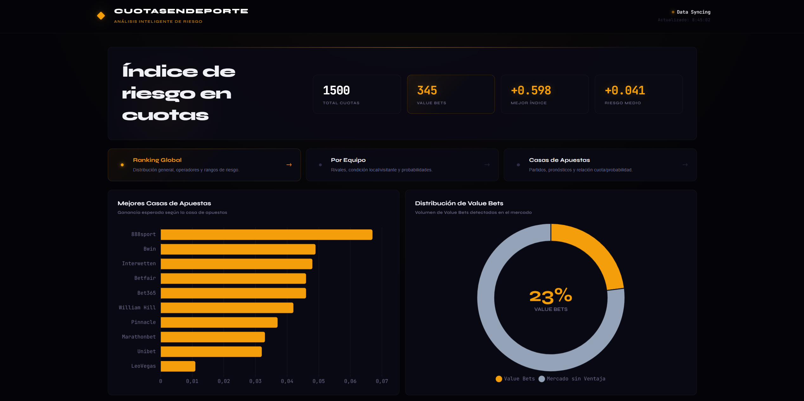
</p>

Ranking de cuotas recomendadas con tarjetas destacadas:

<p align="center">
  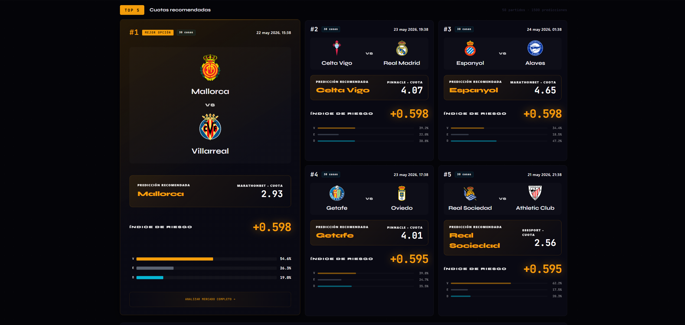
</p>

Análisis filtrado por equipo:

<p align="center">
  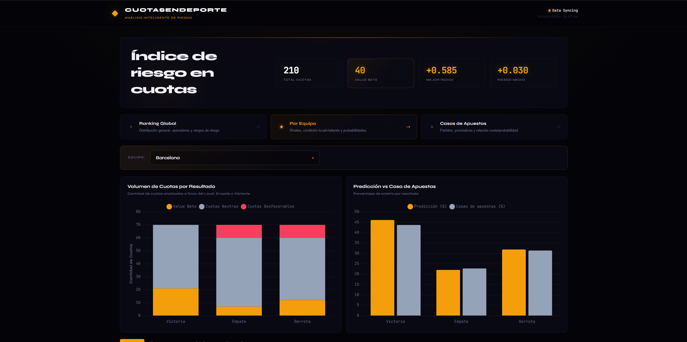
</p>

Cuotas recomendadas para un equipo concreto:

<p align="center">
  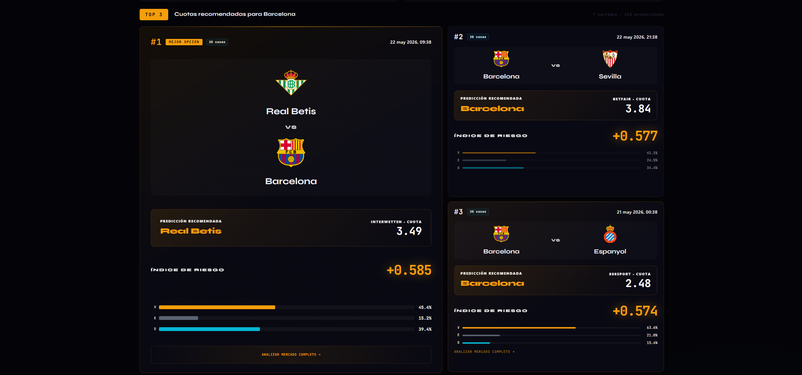
</p>

Análisis filtrado por casa de apuestas:

<p align="center">
  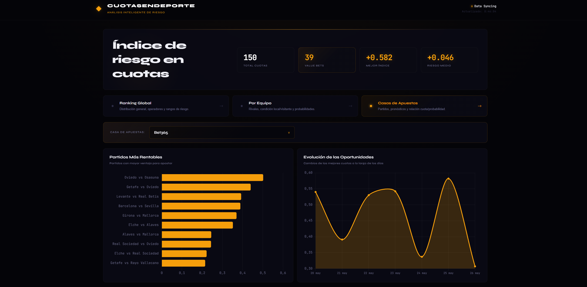
</p>

Cuotas recomendadas para una casa de apuestas concreta:

<p align="center">
  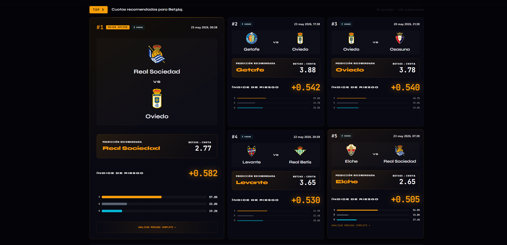
</p>

Tabla paginada con el resto de predicciones:

<p align="center">
  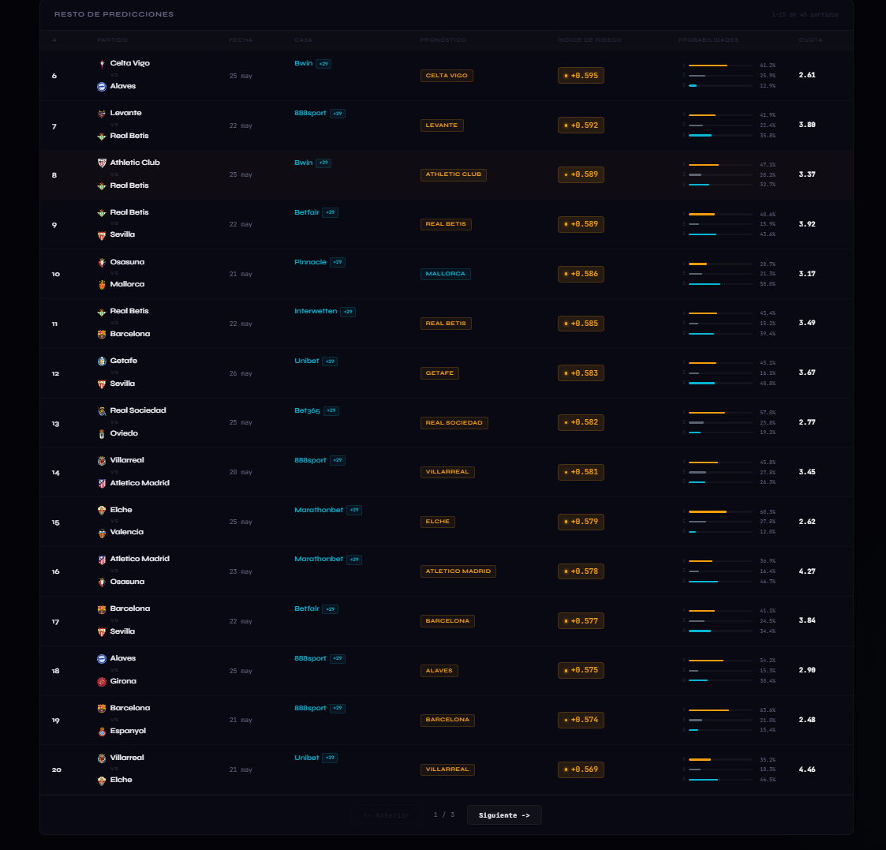
</p>

---

## Arquitectura del Sistema

El sistema se organiza siguiendo varias ideas de la teoría de arquitecturas de sistemas:

- **Arquitectura de tres capas**: el Dashboard actúa como capa de presentación, `business-unit` y `datamart-builder` concentran la lógica de aplicación, y SQLite junto con el Event Store forman la capa de datos.
- **Integración mediante middleware**: los módulos no se conectan punto a punto. Publican y consumen mensajes a través de Apache ActiveMQ, que cumple el papel de middleware de integración, en la línea de una arquitectura EAI/ESB.
- **Arquitectura Lambda**: los eventos entrantes alimentan una ruta histórica y una ruta de baja latencia. La ruta histórica conserva la copia maestra en crudo dentro del Event Store y permite entrenar el modelo; la ruta rápida procesa cuotas nuevas con el modelo ONNX para actualizar el datamart.
- **Datamart**: `database/predictions.db` es una vista parcial, optimizada y orientada a consumo analítico. No almacena todos los eventos crudos, sino las predicciones ya preparadas para la API REST y el dashboard.

En este proyecto, el Event Store funciona como repositorio maestro de eventos en formato original, mientras que el datamart contiene la información ya transformada y lista para consulta.

### Flujo Global de Datos

```mermaid
flowchart LR
    classDef external fill:#fef3c7,stroke:#d97706,color:#78350f,stroke-width:1.5px
    classDef feeder fill:#dbeafe,stroke:#2563eb,color:#172554,stroke-width:1.5px
    classDef broker fill:#fee2e2,stroke:#dc2626,color:#7f1d1d,stroke-width:1.5px
    classDef storage fill:#dcfce7,stroke:#16a34a,color:#14532d,stroke-width:1.5px
    classDef ml fill:#ede9fe,stroke:#7c3aed,color:#3b0764,stroke-width:1.5px
    classDef serving fill:#cffafe,stroke:#0891b2,color:#164e63,stroke-width:1.5px

    OddsAPI["The Odds API"]:::external
    FootballAPI["Football-Data.org"]:::external

    OddsFeeder["odds<br/>Feeder de cuotas"]:::feeder
    ResultsFeeder["results<br/>Feeder de resultados"]:::feeder

    Broker["Apache ActiveMQ<br/>tcp://localhost:61616"]:::broker
    TopicOdd["Topic FootballOdd"]:::broker
    TopicResult["Topic FootballResult"]:::broker

    ESB["event-store-builder<br/>Suscriptor durable"]:::storage
    EventStore[("Event Store<br/>.events")]:::storage

    ML["machine-learning<br/>Python pipeline"]:::ml
    Model[("models/match_model.onnx")]:::ml

    DMB["datamart-builder<br/>Inferencia ONNX + BRI"]:::ml
    SQLite[("Datamart SQLite<br/>database/predictions.db")]:::storage

    BU["business-unit<br/>API REST Javalin"]:::serving
    UI["Dashboard<br/>http://localhost:7070"]:::serving

    OddsAPI --> OddsFeeder --> TopicOdd
    FootballAPI --> ResultsFeeder --> TopicResult
    TopicOdd --> Broker
    TopicResult --> Broker

    Broker --> ESB --> EventStore
    EventStore --> ML --> Model
    Model --> DMB
    EventStore --> DMB
    Broker --> DMB
    DMB --> SQLite
    SQLite --> BU --> UI
```

---

## Arquitectura de la Aplicación

### Módulo `odds`

Responsabilidad: consultar The Odds API cada 24 horas y publicar cada cuota `h2h` como evento independiente.

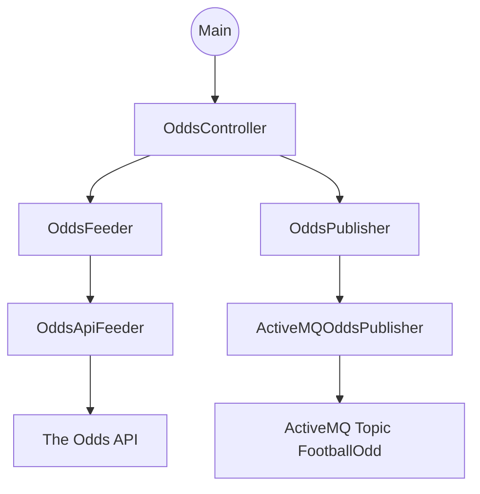

Patrones aplicados:

- **Puertos y adaptadores**: `OddsFeeder` y `OddsPublisher` separan la lógica del proveedor externo y del broker.
- **Inyección de dependencias**: `OddsController` recibe feeder y publisher por constructor.
- **Ejecución programada**: `ScheduledExecutorService` ejecuta la captura cada 24 horas.
- **Records como objetos de valor**: `Odd`, `MatchContext` y `BookmakerContext`.

### Módulo `results`

Responsabilidad: consultar Football-Data.org cada 24 horas, filtrar partidos `FINISHED` y publicar solo resultados nuevos.

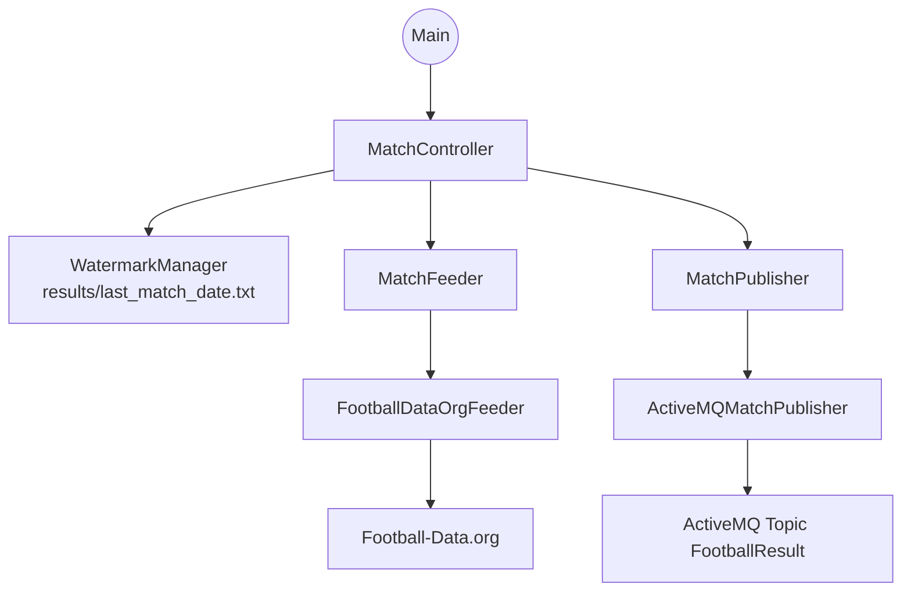

Patrones aplicados:

- **Patrón Watermark**: evita republicar partidos ya procesados.
- **Puertos y adaptadores**: `MatchFeeder` y `MatchPublisher`.
- **Inyección de dependencias**: `MatchController` recibe feeder, publisher y watermark.
- **Records como objetos de valor**: `Match`, `Team` y `Referee`.

### Módulo `event-store-builder`

Responsabilidad: suscribirse de forma durable a los topics del broker y persistir eventos crudos.

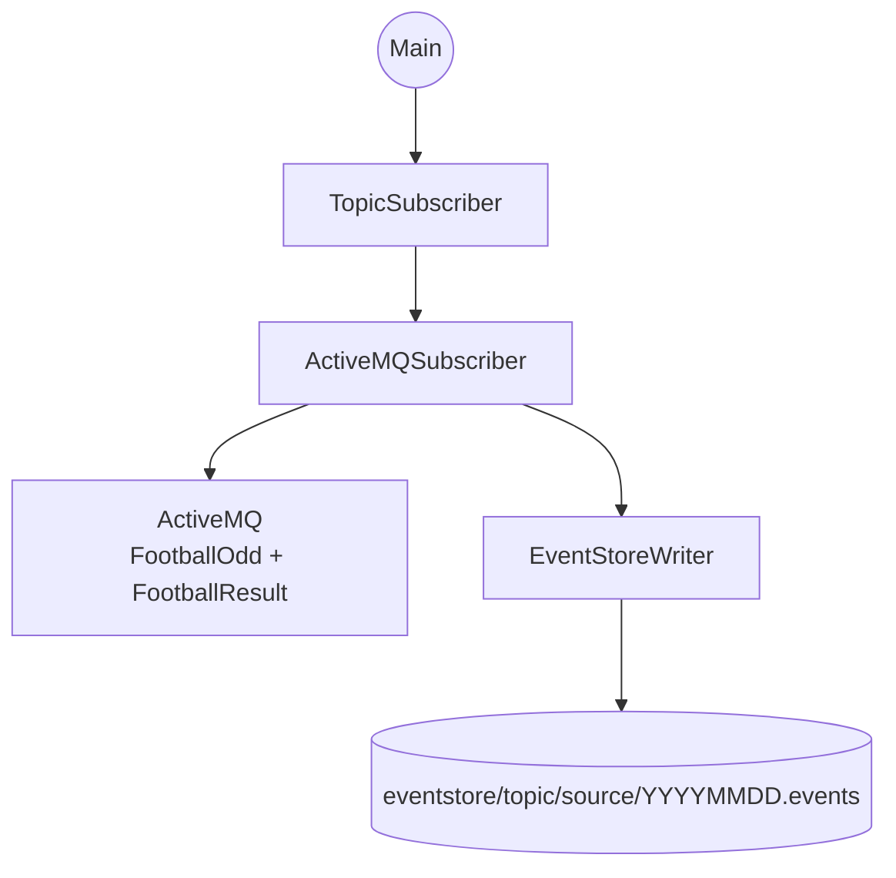

Patrones aplicados:

- **Publisher/Subscriber**: desacopla productores y consumidores.
- **Suscriptor durable**: `ActiveMQSubscriber` usa `clientID` y suscripciones durables.
- **Event Sourcing básico**: los eventos crudos se conservan antes de transformarlos.
- **Reintento con backoff**: reconexión progresiva si ActiveMQ no está disponible.

### Módulo `machine-learning`

Responsabilidad: transformar el histórico de resultados en un dataset de entrenamiento y exportar un modelo ONNX.

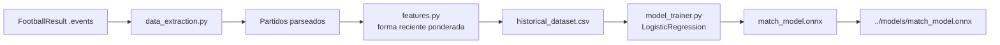

Features usadas:

| Feature | Descripción |
|---|---|
| `Home_Streak_Points` | Puntos ponderados recientes del local |
| `Away_Streak_Points` | Puntos ponderados recientes del visitante |
| `Home_Avg_Goals_For` | Goles a favor ponderados del local |
| `Home_Avg_Goals_Against` | Goles en contra ponderados del local |
| `Away_Avg_Goals_For` | Goles a favor ponderados del visitante |
| `Away_Avg_Goals_Against` | Goles en contra ponderados del visitante |

El peso temporal usa decaimiento exponencial con `lambda = 0.9`, dando más importancia a los partidos recientes.

### Módulo `datamart-builder`

Responsabilidad: entrenar/recargar el modelo, escuchar cuotas en tiempo real, inferir probabilidades y escribir predicciones.

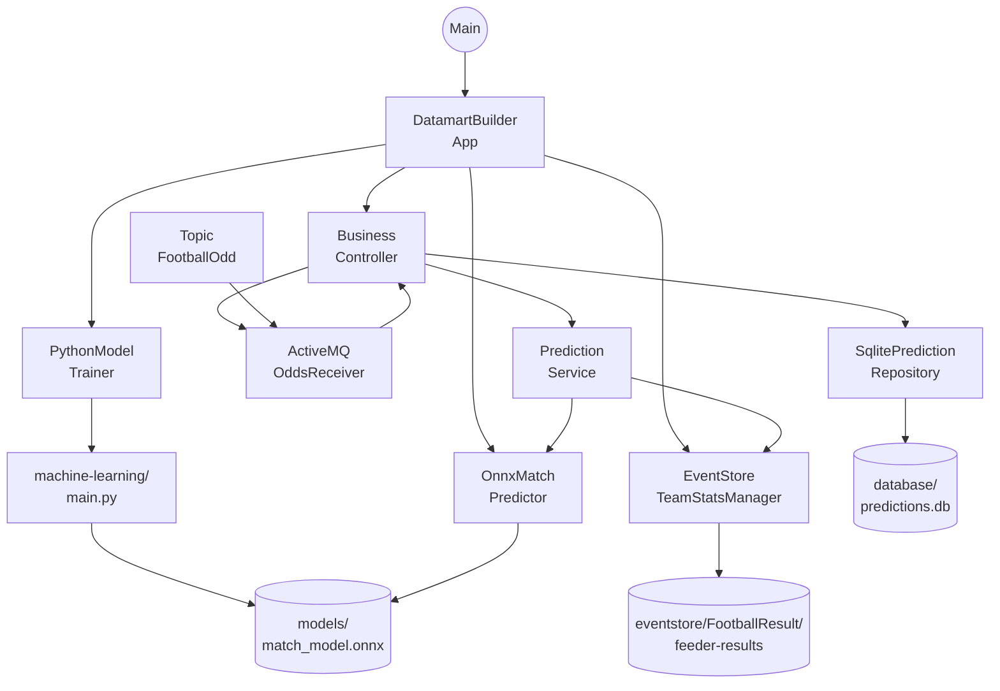

Patrones aplicados:

- **Repositorio**: `PredictionRepository` y `SqlitePredictionRepository`.
- **Estrategia/Puerto**: `MatchPredictor`, `TeamStatsManager` y `ModelTrainer`.
- **Caché**: `PredictionCache` evita recalcular probabilidades para el mismo partido.
- **Interoperabilidad ONNX**: modelo entrenado en Python e inferido desde Java.
- **Mantenimiento programado**: limpieza, reentrenamiento y recarga de estadísticas cada 24 horas.

### Módulo `business-unit`

Responsabilidad: leer el datamart, exponer API REST y servir el dashboard.

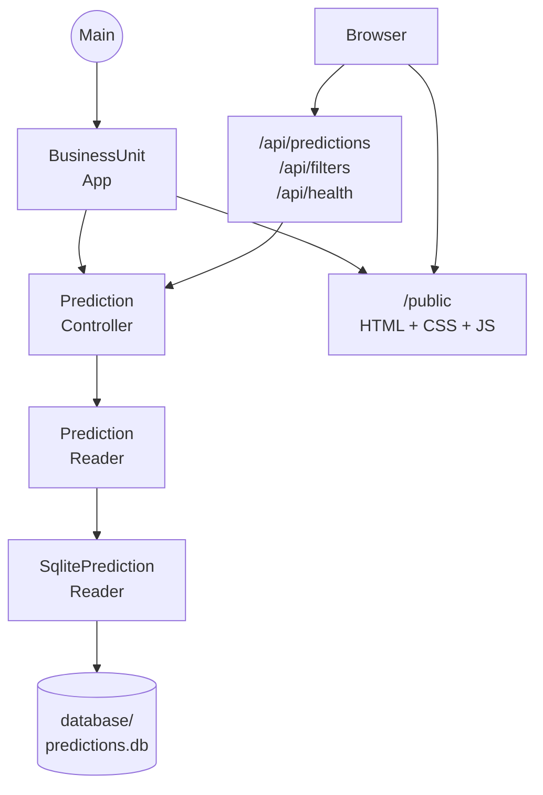

Patrones aplicados:

- **MVC ligero**: controlador REST, repositorio de lectura y vista estática.
- **DTO**: `PredictionDTO` y `FilterOptionsDTO`.
- **Repositorio**: `PredictionReader` abstrae las consultas del dashboard.
- **Servicio de ficheros estáticos**: Javalin sirve frontend y API desde el mismo proceso.

---

## Principios y Patrones de Diseño Aplicados

### SOLID

| Principio | Aplicación en el proyecto |
|---|---|
| SRP | Feeders capturan datos, publishers publican, repositories persisten, controllers orquestan |
| OCP | Interfaces como `OddsFeeder`, `MatchPredictor`, `PredictionRepository` permiten cambiar implementaciones |
| DIP | Los controladores dependen de abstracciones, no directamente de APIs, ActiveMQ o SQLite |
| ISP | Interfaces pequeñas: `OddsReceiver`, `ModelTrainer`, `TeamStatsManager`, `PredictionReader` |

### Patrones Arquitectónicos

| Patrón | Dónde aparece |
|---|---|
| Arquitectura orientada a eventos | Comunicación entre feeders, Event Store y datamart mediante ActiveMQ |
| Publisher/Subscriber | `odds` y `results` publican; `event-store-builder` y `datamart-builder` consumen |
| Event Store | Persistencia de eventos crudos en `.events` |
| Repositorio / DAO | `SqlitePredictionRepository`, `SqlitePredictionReader` |
| Puertos y adaptadores | Feeders, publishers, predictors, trainers y readers detrás de interfaces |
| Pipeline ETL | `machine-learning`: extracción, transformación, entrenamiento y exportación |
| Capa de servicio | SQLite + Javalin + dashboard |

---

## Limitaciones

El proyecto está diseñado como prototipo académico. Sus limitaciones actuales son importantes:

- El modelo solo usa features de forma reciente: puntos, goles a favor y goles en contra.
- No incorpora lesiones, alineaciones, calendario europeo, localización, clima, tarjetas, posesión ni tiros.
- Las cuotas pueden variar rápidamente y la disponibilidad de bookmakers depende del plan y región de The Odds API.

---

## Trabajo Futuro

### Validación del Modelo

- Añadir split temporal train/test.
- Medir accuracy, log loss y Brier score.
- Calibrar probabilidades con Platt Scaling o Isotonic Regression.
- Comparar Regresión Logística con Random Forest, XGBoost o modelos Poisson.

### Enriquecimiento de Datos

- Añadir estadísticas avanzadas: tiros, posesión, xG, faltas, tarjetas y corners.
- Incorporar lesiones, sanciones y rotaciones.
- Añadir variables de mercado: movimiento de cuotas, dispersión entre bookmakers y probabilidad implícita.

### Mejoras de Arquitectura

- Externalizar configuración (`broker.url`, rutas, topics, puerto, API keys) en variables de entorno o properties.
- Añadir tests unitarios y de integración.
- Añadir health checks por módulo.
- Añadir Docker Compose para ActiveMQ y la aplicación.

---

## Solución de Problemas

| Problema | Causa probable | Solución |
|---|---|---|
| `No se encuentra el ejecutable de Python` | No existe `machine-learning/venv` | Crear el venv e instalar `requirements.txt` |
| `No se ha podido localizar la carpeta eventstore` | `datamart-builder` se ejecutó desde una ubicación incorrecta | Ejecutar el módulo desde la raíz del proyecto |
| Dashboard vacío | No hay predicciones en SQLite | Comprobar que `datamart-builder`, `event-store-builder`, `results` y `odds` están activos con ActiveMQ |
| Estado `Offline` en el Dashboard | La API REST no responde o devuelve error | Verificar que `business-unit` está ejecutándose en `http://localhost:7070` |
| Error de conexión JMS | ActiveMQ no está arrancado | Iniciar ActiveMQ en `tcp://localhost:61616` |
| API devuelve 401/403 | API key inválida o cuota agotada | Revisar tokens de The Odds API o Football-Data.org |
| `business-unit` no lee datos | Ruta relativa a `database/predictions.db` incorrecta | Ejecutar desde la raíz del proyecto |

---

## Tecnologías

| Tecnología | Versión usada | Propósito |
|---|---:|---|
| Java | 21 | Backend modular |
| Maven | 3.8+ | Build multi-módulo |
| Apache ActiveMQ | 5.15.12 | Broker JMS |
| Gson | 2.8.9 / 2.10.1 | Serialización JSON |
| Javalin | 6.4.0 | API REST y frontend estático |
| SQLite JDBC | 3.45.1.0 | Datamart embebido |
| ONNX Runtime | 1.20.0 | Inferencia Java |
| Python | 3.10+ | Pipeline ML |
| pandas | 2.2+ | Preparación de datos |
| scikit-learn | 1.5+ | Regresión Logística |
| skl2onnx | 1.17+ | Exportación ONNX |
| NumPy | 1.26+ | Operaciones numéricas |
| Chart.js | CDN | Visualizaciones web |

---

## Autoría

Proyecto desarrollado para la asignatura **Desarrollo de Aplicaciones para Ciencia de Datos (DACD)**.

| | |
|---|---|
| **Autores** | Tomás Santana Suárez<br/>Pablo Santana González |
| **Titulación** | Grado en Ciencia e Ingeniería de Datos |
| **Universidad** | Universidad de Las Palmas de Gran Canaria (ULPGC) |
